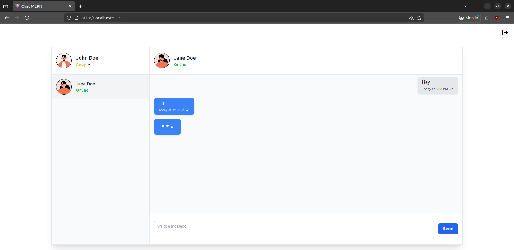

# 🚀 MERN Chat App with Socket.io and TypeScript

A **real-time chat application** built with the **MERN stack** (MongoDB, Express, React), enhanced with **Socket.io** for live messaging and **TypeScript** for type safety. The backend runs with **tsx**, making development faster with native TypeScript support.

Users can chat directly with their contacts, see when the other person is typing in real time, and reset passwords securely via email. The project also integrates an **external API for profile pictures** (Avatar Placeholder) and uses **Nodemailer** for email verification and password recovery.

---



---

## 💬 Features

### ✅ Implemented

* 💌 **Real-time Messaging**: Send and receive messages instantly using WebSockets
* 💬 **Typing Indicator**: Displays in real time when the other user is typing a message
* 🔒 **User Authentication**: Sign up and log in securely with JWT
* 📧 **Email Verification**: Users must validate their email to activate their account
* 🔑 **Forgot Password**: Password reset system via email (Nodemailer)
* 👥 **Direct Chat with Contacts**: Users can message their contacts (no group chats yet)
* 🟢 **User Status**: Users can set and update their online status (Online, Away, Busy)
* ⚡ **Responsive UI**: Clean and intuitive interface built with React
* 📝 **TypeScript**: Fully typed backend (tsx + Express) and frontend
* 🗄 **Message and User Storage**: MongoDB database with Mongoose
* 🖼 **Profile Pictures**: Integration with an external API to display user avatars (Avatar Placeholder)
* 🔄 **REST & Socket.io Integration**: REST APIs for data persistence and Socket.io for live updates

### ⏳ To Do / Improvements

* 🔔 **Notifications**: Alerts for new messages or mentions
* 🎨 **UI/UX Enhancements**: Animations, typing indicators, message read receipts
* 📜 **Message History**: Pagination or lazy loading for improved performance
* 🛡 **Security Enhancements**: Rate-limiting
* 🔍 **Search & Filtering**: Search for contacts or messages
* 🧑‍💻 **Profile & Account Management**:
  * ✏️ Change username
  * 📧 Change email
  * 🖼 Upload profile picture
* 📝 **Admin Support System**: Ticket system for users to contact admins
* ✅ **Unit & E2E Testing**: Backend and frontend tests for reliability
* 👥 **Future Group Chat Support**: Adding rooms or group conversations

---

## ⚙ Tech Stack

* 🖥 **Frontend**: React, TypeScript, Vite, Axios, TailwindCSS, Radix-UI, Motion, React-Toastify
* ⚙️ **Backend**: Express, TypeScript, Socket.io, tsx
* 🗄 **Database**: MongoDB with Mongoose
* 🔄 **Real-time**: Socket.io
* 🔒 **Authentication**: JWT

---

## ⚡ Installation

1. Clone the repository:

```bash
git clone https://github.com/PtitKrugger/Chat-MERN.git
```

2. Install dependencies for server and client:

```bash
npm install
cd /client
npm install
```

3. Configure environment variables (`.env` files) for server and client:

```
DATABASE_URL=your_mongodb_uri
JWT_SECRET=your_jwt_secret
PORT=5000
SMTP_USER=your_email@example.com
SMTP_PASS=your_email_password
SMTP_HOST=smtp.your-email-provider.com
SMTP_PORT=587
NODE_ENV="development" or "production"
```

4. Run the development server with **tsx**:

```bash
# in main folder
npm run server
```

5. Run the client with **Vite**:

```bash
# in frontend folder
npm run dev
```

---

## 📧 Email Setup (Nodemailer)

The email functionality (verification and password reset) is configured in:

```
backend/helpers/auth.helper.ts
```

### Development

For local development, you can use a **local SMTP server** like **MailHog** or **MailDev**:

```ts
const transporter = nodemailer.createTransport({
    host: "localhost",
    port: 1025,
    ignoreTLS: true
});
```

* Start MailHog locally to catch outgoing emails.
* Emails will be visible in the local SMTP web interface.

### Production

For production, replace with a real SMTP service (Gmail, SendGrid, etc.), and replace the localhost links inside the helper with your URL:

```ts
const transporter = nodemailer.createTransport({
    host: process.env.SMTP_HOST,
    port: Number(process.env.SMTP_PORT),
    secure: false, // true for 465, false for other ports
    auth: {
        user: process.env.SMTP_USER,
        pass: process.env.SMTP_PASS
    }
});
```

---

### ⚠️ Production Note

If you deploy the application, make sure to **replace all `localhost` URLs** in the frontend (hooks, pages, API calls, etc.) with your **production backend URL**.

* This applies to **all Axios requests** in your hooks, pages, and service files.
